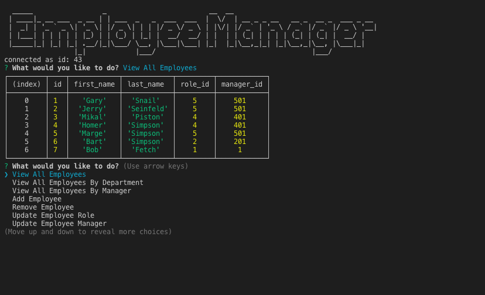

# Employee Management System

# Description
A simple command-line application that allows non-developers to view and interact with information stored in databases.

## Table of Contents
* [Installation](#installation)
* [Usage](#usage)
* [Resources](#resources)
* [Credits](#credits)
* [License](#license)
* [Contributing](#contributing)
* [Questions](#questions)

## Installation
### Steps required to run locally
1. Clone/download the code in this repo
2. Navigate to the location of the code downloaded
3. Double-click on the html file provided in the downloaded code to preview 

## Usage 
This code should be used for the purpose of creating/editing code for a Employee Tracker. This code has not been deployed to a live site. It must be run locally.  
  

## Resources
[figlet](https://www.npmjs.com/package/figlet) npm package to create ascii art text    
[module export for mysql connection](https://stackoverflow.com/questions/34788750/module-export-for-mysql-connection)  
[mysql connections](https://www.mysqltutorial.org/mysql-nodejs/connect/)  

## Credits
1 contributor: @stopdaydreaming  

## License
Copyright (c) Employee Tracker. All rights reserved.
Licensed under the [MIT](LICENSE) license.

## Features
None at this time

## Contributing
None at this time

## Tests
None at this time  

## Badges
